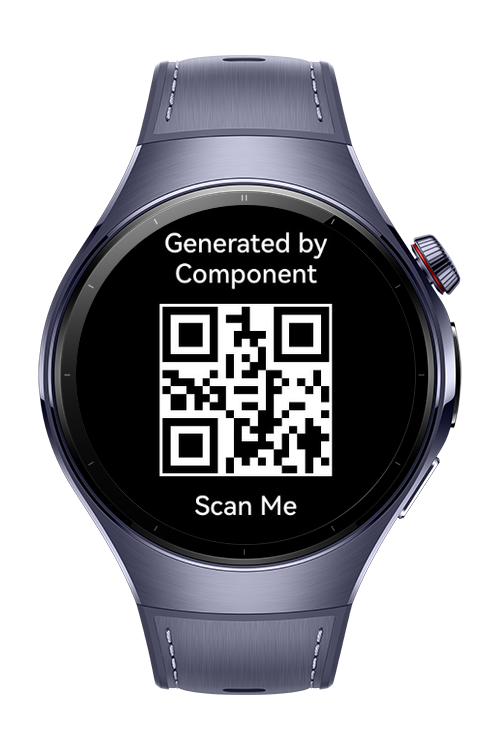
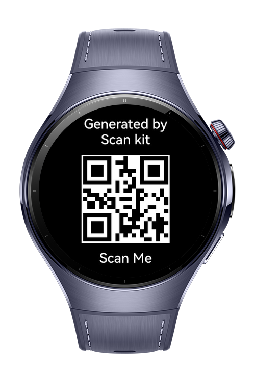
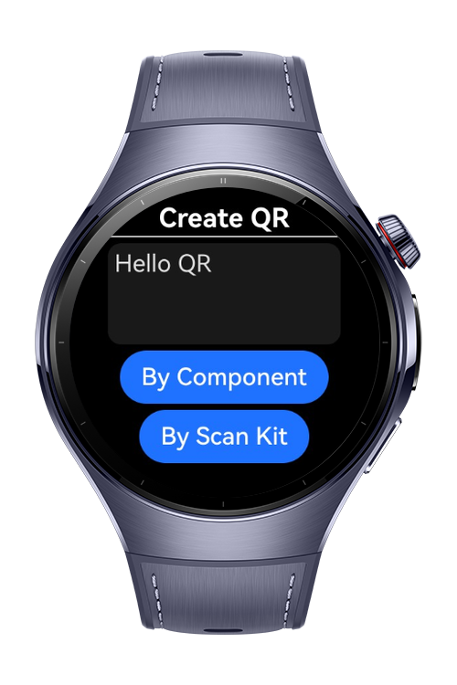

> **Note:** To access all shared projects, get information about environment setup, and view other guides, please visit [Explore-In-HMOS-Wearable Index](https://github.com/Explore-In-HMOS-Wearable/hmos-index).

# How to generate QR Code

This app demonstrates different approaches to creating and managing QR codes in **HarmonyOS NEXT** applications using
**ArkTS**. It explores QR code generation with the built-in QRCode component for straightforward rendering, as well as
integration with Scan Kit for more advanced generation and management features.

# Preview

<div>
  
  
  
</div>

# Use Cases

The QR Code Generator is designed to help developers and users explore different ways of generating QR codes on
HarmonyOS NEXT devices. It provides practical scenarios where QR code creation can be seamlessly integrated into daily
use and application development:

1. Instant QR Code Generation: Quickly create QR codes within the app using the built-in QRCode component for simple
   sharing or testing.
2. Enhanced QR Management with Scan Kit: Leverage HarmonyOS Scan Kit to generate more advanced QR codes with extended
   customization and reliability.
3. Learning and Prototyping: Developers can use the app as a hands-on reference for implementing QR code features in
   their own projects.
4. Wearable and Mobile Compatibility: Demonstrates how QR code generation works efficiently on both wearable devices and
   mobile HarmonyOS NEXT applications.
5. Practical Everyday Scenarios: Supports use cases like sharing contact information, generating payment codes, linking
   to websites, or providing quick access to app features.

# Tech Stack

- **Languages**: ArkTS
- **Frameworks**: HarmonyOS SDK 5.1.0(18)
- **Tools**: DevEco Studio Version 5.1.0.849
- **Libraries**:
    - `@kit.AbilityKit`
    - `@kit.ArkUI`
    - `@kit.PerformanceAnalysisKit`

# Directory Structure

   ```
entry/src/main/ets/
├── pages/                                # Application pages (UI screens for QR features)
│   ├── QRInputPage                       # Page for entering data to be converted into a QR code
│   ├── QRGenerateKitPage                 # Page demonstrating QR code generation using HarmonyOS Scan Kit
│   └── QRGenerateComponentPage           # Page demonstrating QR code generation using the built-in QRCode component
│
├── entryability/                         # Main ability (manages app lifecycle and entry point)
│   └── EntryAbility.ets
│
└── entrybackupability/                   # Backup/restore ability (handles data persistence and recovery)
    └── EntryBackupAbility.ets
   ```

# Constraints and Restrictions

## Suported Devices

- Huawei Watch 5

## Limitations

- Image Generated by Pixel Map from Scan Kit won't be visible on Previewer.

# License

**QRCodeGenerator** is distributed under the terms of the MIT License
See the [LICENSE](./LICENSE) for more information.